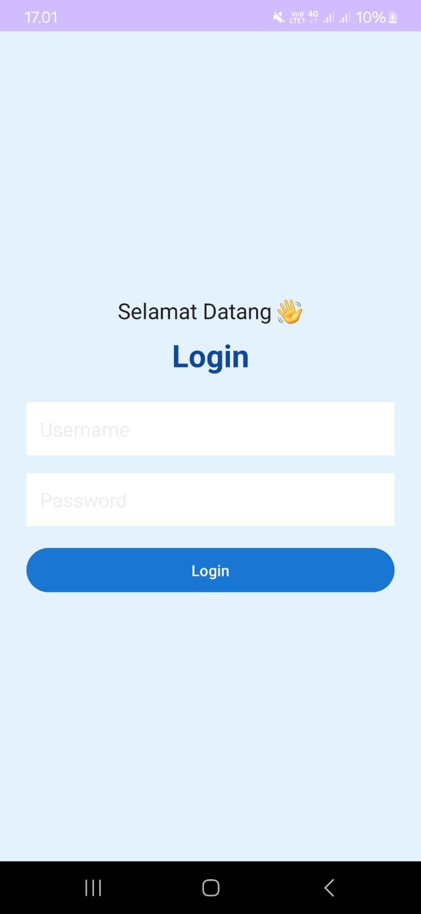
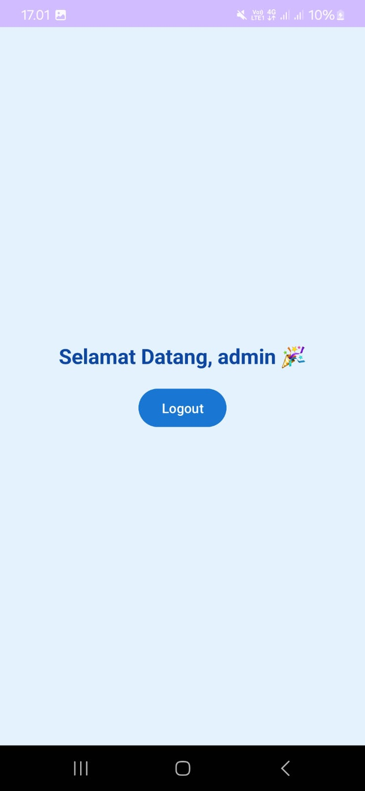

# 📱 Tugas1 - Aplikasi Login Android (Kotlin + XML)

## 🎯 Fitur Utama

* Input **Username** dan **Password**
* Validasi:

  * Tidak boleh kosong
  * Harus sesuai dengan data yang ditentukan
* Navigasi dari **Login → Beranda**
* Menampilkan **username di halaman beranda**
* Tombol **Logout**
* Tampilan UI sederhana

---

## 🔐 Data Login

Gunakan akun berikut:

* **Username:** admin
* **Password:** 123

---

## 🖼️ Screenshot Aplikasi

### 🔑 Halaman Login

### 🏠 Halaman Beranda

---

* Nama: Rizky Surya Diputra
* Nim: 23552011390
* Project: Tugas1 - Pemrograman Mobile I

---
